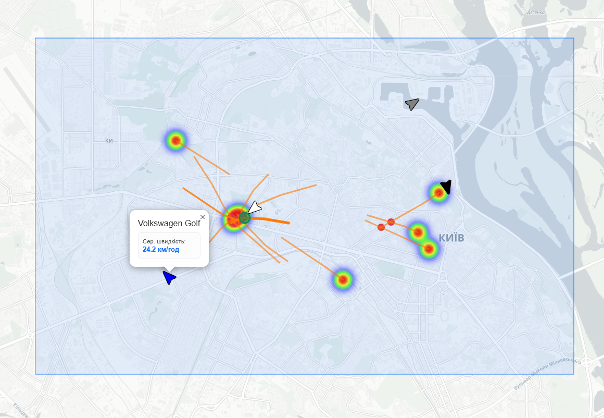
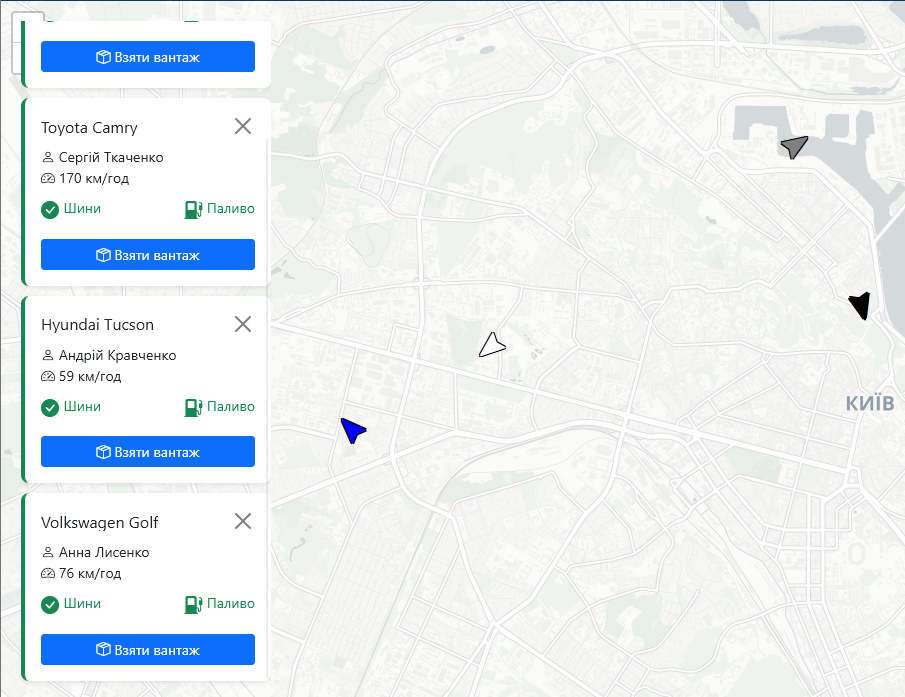

# Taxi Service Analytics & Live Monitoring


Комплексна GIS (геоінформаційна система) для транспорту, що складається з трьох основних модулів: 

* **Analytics Map** - аналіз маршрутів та теплових карт
* **Live Map** - моніторинг водіїв у реальному часі
* **Taxi Map** - симуляція замовлення таксі


## 🚀 Основні можливості

### 📊 Analytics Dashboard
* **Виділення:** Інструмент виділення довільних областей на карті.
* **Аналітика:** Аналітика маршрутів та швидкості.
* **Теплові карти:** Візуалізація гарячих точок активності (Heatmaps).
* **Перехрестя:** Розрахунок та візуалізація точок перетину маршрутів.



### 📍 Live Monitoring
* **Реальний час:** Відображення водіїв на карті через WebSockets.
* **Керування:** Перемикання статусу вантажу (cargo) з миттєвим оновленням.
* **Історія:** Відтворення переміщень (rewind) за часовими мітками.
* **Трекінг:** Візуалізація активних маршрутів.



## 🛠 Технологічний стек

* **Backend:** Django, DRF, Django Channels, Daphne, WebSockets, ASGI.
* **Frontend:** TypeScript, Leaflet, Bootstrap 5, Vite, NPM.
* **Database:** PostGIS, Redis.
* **Maps:** GeoJSON, Nominatim, OSRM, CartoDB.

## 📂 Структура проєкту

```text
├── accounts/        # Кастомні юзери та профілі, oauth
├── assets/          # TypeScript файли та конфігурація Vite
├── rides/           # Логіка моніторінгу та статистики
├── vehicles/        # База автомобілів (fleet)
├── templates/       # Базові та специфічні Django шаблони
└── static/          # Статичні ресурси
```
## ⚙️ Встановлення

### 1. Підготовка
Клонуйте репозиторій:

```git clone https://github.com/imgVOID/uber_django_leaflet/tree/main```

### 2. Віртуальне середовище
Створіть оточення Python:

```python -m venv .venv```

Активуйте його:
* Linux/macOS: `source .venv/bin/activate`
* Windows: `.venv\Scripts\activate`

### 3. Залежності
Встановіть бібліотеки:

`pip install -r requirements.txt`

### 4. База даних
Запустіть базу PostGIS на звичайному порті та виконайте міграції

`python manage.py migrate`

### 5. Адмін
Створіть супер юзера:

`python manage.py createsuperuser`

### 6. Фікстури
Створіть фікстури:

`python manage.py loaddata {fixtrename}`

### 5. Запуск
Запустіть бекенд:
`python manage.py runserver`

Запустіть фронтенд:
`npm install && npm run dev`

### 5. Тест WebSocket
Запустіть клієнта, який імітує переміщення по мапі. 
Основне використання: створення маршруту по доставці карго, тест вебсокета, візуальний тест переміщення автомобіля по мапі.

`python websocket_test_driver.py`

## Виконані завдання
### Live View
1. Live view дозволяє операторам спостерігати за загальним станом парку транспортних засобів на 2D-мапі. 
2. Візуалізація поточної та останньої швидкості транспортного засобу.
3. Візуалізація поточного стану транспортного засобу, включно з іконками для подій на кшталт пробитого колеса, низького рівня
пального та інших аварійних ситуацій.
4. Візуалізація маршруту транспортного засобу від останньої точки, де він завантажив вантаж клієнта, в реальному часі.
5. Перемотування часу назад для перегляду стану усіх транспортних засобів у
конкретний момент часу, до 6 місяців у минулому. 

### Analytics Views
1. Відображення середньої швидкості вибраного транспортного засобу.
2. Відображення найбільш популярної дороги у вказаній області.
3. Відображення середньої швидкості автомобілів на найбільш популярній дорозі, серед обраних
транспортних засобів, які раніше використовували цей маршрут.
4. Відображення місця, де транспортні засоби найчастіше завантажувалися вантажем у вибраній області, у
форматі heatmap.
5. Відобразити всіх маршрутів, які починаються у вибраній області.
6. Відображення перехресть між маршрутами в обраній області.
7. Відображення всіх початкових точок маршрутів у вибраній області у вигляді heatmap (в даній архітектурі ідентично підбору карго).